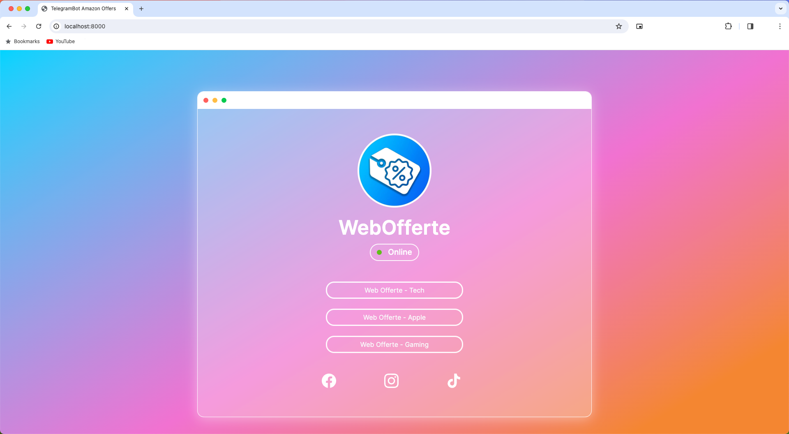

<!--TelegramBot-AmazonOffers-->
<!--TelegramBot AmazonOffers-->
<!--**RELEASED-DATA**-->

<div id="top"></div>
<br/>
<br/>


<p align="center">
  
</p>
<h1 align="center">
    <a href="https://github.com/Piero24/TelegramBot-AmazonOffers">TelegramBot AmazonOffers</a>
</h1>
<p align="center">
    <!-- BADGE -->
    <!--
        *** You can make other badges here
        *** [shields.io](https://shields.io/)
        *** or here
        *** [CircleCI](https://circleci.com/)
    -->
    <a href="https://github.com/Piero24/TelegramBot-AmazonOffers/commits/master">
    
    </a>
    <a href="https://github.com/Piero24/TelegramBot-AmazonOffers">
    
    </a>
    <!--<a href="https://github.com/Piero24/TelegramBot-AmazonOffers">
    
    </a> -->
    <a href="https://github.com/Piero24/twitch-stream-viewer/issues">
    
    </a>
    <a href="https://github.com/Piero24/TelegramBot-AmazonOffers/blob/master/LICENSE">
    
    </a>
</p>
<p align="center">
    A Telegram bot that send offers from Amazon.
    <br/>
    <!-- <a href="documentation.md"><strong>Explore the docs »</strong></a>
    <br/> -->
    <br/>
    <a href="https://linktr.ee/webofferte">View Demo</a>
    •
    <a href="https://github.com/Piero24/TelegramBot-AmazonOffers/issues">Report Bug</a>
    •
    <a href="https://github.com/Piero24/TelegramBot-AmazonOffers/issues">Request Feature</a>
</p>


---


<br/><br/>
<h2 id="itroduction">📔  Itroduction</h2>
<p>
    This bot is designed to send offers from Amazon to a Telegram channel. By providing different keywords, the bot will search for the best offers and return a series of products with the relative information. Then the information are parsed for extract only relevant information like:
    <ul>
        <li>Title</li>
        <li>Bullet Points</li>
        <li>Current Price</li>
        <li>Original Price</li>
        <li>Image</li>
    </ul>
    By using some basic algorithm the bot will select the best offers and send them to the channel. The diffent parameters are hihgly customizable and can be changed by the user. For Exaple you can change the number of products to send and when send it. The quantity of product to require through the <a href="https://programma-affiliazione.amazon.it/assoc_credentials/home"><strong>Amazon Product Advertising API (PAAPI)</strong></a> and the working time. Also the image sended to the channel as a preview of the product can be changed.
</p>
<br/>

<br/>
<br/>
<p>
    The bot provide also a web page that show if the bot is still online and that provide a direct link to al the channels connected to the bot. You can find the web page <a href="https://localhost:8000"><strong>localhost:8000</strong></a> By default.
</p>
<p>
    The background image of the product instead is highly costumazible. Also the font and the color of the text can be changed.
</p>
<br/>
<table>
  <tr  align="center">
    <th><strong>Web Page</strong></th>
    <th><strong>Personalized image example</strong></th> 
  </tr>
  <tr  align="center">
    <th></th>
    <th></th> 
  </tr>
</table>
<br/>
<br/>

<h3 align="center">
     ⚠️ ATTENTION ⚠️ 
</h3>
<p align="center">
    Since I hanven't an account from another country I didn't test the bot in the different reagions like UK, US, ESP, FR and so on. So I can't guarantee the bot will work in all the regions. But You can fix the problem in a couple of steps. Or you can report the problem here: <a href="https://github.com/Piero24/TelegramBot-AmazonOffers/issues"></a><strong>Report Bug</strong></a> And I will fix it as soon as I wind an API Key for the tests.
</p>
<p align="center">
    To use this bot you need to have an Amazon account and an API key. You can require your API key <a href="https://programma-affiliazione.amazon.it/home"><strong>here</strong></a>. 
</p>
<p align="center">
    No responsibility is assumed for the use of the bot and the data it provides. The use of it at your own risk.
    To check the Amazon regulation about the PAAPI see the <a href="https://webservices.amazon.com/paapi5/documentation/best-programming-practices.html"><strong>PAAPI Documentation</strong></a> section.
</p>
<p align="center">
    The storage of any information returned by the PAAPI is <strong>NOT PERMITTED</strong>. To this reason it's difficult to know the difference between price of a product already send and the same product in the queue or other comparation. As mentioned here basically all the information returned by the PAAPI must be cancelled in a couple of hours (se <a href="https://webservices.amazon.com/paapi5/documentation/best-programming-practices.html#how-to-cache">here</a> for more information). But the only data that is not mentioned so che can assume it is possibile to store is the product ASIN. This is used <strong>ONLY</strong> for preventing to send the same product more times in a certain period.
</p>
<p align="center">
    If you wan't to support the project subscribe to one of the channel at this link: <a href="https://linktr.ee/webofferte"><strong>WebOfferte</strong></a>
</p>
<br/>


<h2 id="made-in"><br/>🛠  Built in</h2>
<p>
    This project is entirely written in <strong>Python</strong> and uses the <strong>Amazon Product Advertising API</strong> for the search of the products and the <strong>Telegram API</strong> to send the message. It use <strong>SQLite</strong> only for the part of the ASIN storage. There is also a part written in <strong>html</strong> and <strong>css</strong> for a web page to advice if the bot is still online and that provide a direct link to al the channels connected to the bot.
</p>
<br/>
<a href="https://www.python.org">Python</a> • <a href="https://www.sqlite.org">SQLite</a> • <a href="">HTML</a> • <a href="">CSS</a> • <a href="https://getbootstrap.com">BootStrap</a> • <a href="https://webservices.amazon.com/paapi5">Amazon PAAPI</a> • <a href="https://github.com/eternnoir/pyTelegramBotAPI">Telegram API</a>

<p align="right"><a href="#top">⇧</a></p>


<h2 id="index"><br/>📋  Index</h2>
<ul>
    <!-- <li><h4><a href="#documentation">Documentation</a></h4></li> -->
    <li><h4><a href="#prerequisites">Prerequisites</a></h4></li>
    <li><h4><a href="#how-to-start">How to Start</a></h4></li>
    <li><h4><a href="#responsible-disclosure">Responsible Disclosure</a></h4></li>
    <li><h4><a href="#report-a-bug">Report a Bug</a></h4></li>
    <li><h4><a href="#license">License</a></h4></li>
    <li><h4><a href="#third-party-licenses">Third Party Licenses</a></h4></li>
</ul>

<p align="right"><a href="#top">⇧</a></p>

<!-- <h2 id="documentation"><br/><br/>📚  Documentation</h2>
<p>
    Here you can find a more detailed documentation about the project. The documentation is divided into different sections to make it easier to find the information you need.
</p>
<p>
    For a broader view it is better to refer the user to the documentation via links: <a href="https://github.com/Piero24/.github/documentation.md">Documentation »</a>
</p>


<p align="right"><a href="#top">⇧</a></p> -->

<h2 id="prerequisites"><br/>🧰  Prerequisites</h2>
There is two way to run the project:

1. With <a href="https://www.docker.com">Docker</a>
2. With the classic environment 

If you want to use the Docker you can skip this part and go to the next section. For the classic installation instead you need to install the required package. You can Install all the requirement in one shot by using the following command:

```sh
    pip install -r requirements.txt
```
Alternatively you can install it one by one the package in the requirements.txt file.

<p align="right"><a href="#top">⇧</a></p>


<h2 id="how-to-start"><br/>⚙️  How to Start</h2>
<p>
    Now we must set up the bot. There are different steps to follow to set up the bot. The steps must be followed in both cases, whether you are using Docker or the classic environment.
</p>

1. Clone the repo
  
    ```sh
    git clone https://github.com/Piero24/TelegramBot-AmazonOffers.git
    ```

2. Setup the `api_Keys.py` file with all the required from Amazon and Telegram.
    You can find an example <a href=".github/api_Keys_Setup.md">here</a>.

3. Setup the `settings.py` file with all the required for running the bot.
    You can find an example <a href=".github/settings.md">here</a>.

4. Setup the `category_keywords.py` file with the categories and the keywords for the search. More information <a href=".github/categories_list.md">here</a>.

5. <strong>Facultative</strong>: There are many other parameters that can be changed. <a href=".github/other_parameters.md">Here</a> you can find more information about what you can do and where you can find it.

<br/>
<h4 align="center">
     ⚠️ ATTENTION ⚠️ 
</h4>
<p align="center">
    Read the point 5 for more information for the personalized image.
</p>
<br/>

<p>
    At this moment all the parameters are set and the bot is ready to run. And the operations are different depending on whether you are using Docker or the classic environment. 
</p>
<h3 id="how-to-start">
     Docker
</h3>
<p>
    Whit docker it's very easy to run the bot. You can run the bot with the following command:
</p>

1. Open docker on your system (different for any platform) and run the following command via ssh or terminal:
  
    ```sh
    docker build -t REPO-NAME .
    ```
    Where `REPO-NAME` is the name of the repository. For example `amazon-offers-bot`. (Remember the dot at the end of the command).

2. Run the bot with the following command:

    ```sh
    docker run -p 8000:8000 REPO-NAME
    ```
    Where `REPO-NAME` is the name of the repository. For example `amazon-offers-bot`. 

<h3 id="how-to-start">
     Python Environment
</h3>

1. Open the terminal and go to the directory `TelegramBot-AmazonOffers` downloaded from the repository.

2. Run the bot with the following command:

    ```sh
    python main.py
    ```

For any problem you can check the log file in the `log` folder.

<p align="right"><a href="#top">⇧</a></p>

---

<h3 id="responsible-disclosure"><br/>📮  Responsible Disclosure</h3>
<p>
    We assume no responsibility for an improper use of this code and everything related to it. We do not assume any responsibility for damage caused to people and / or objects in the use of the code.
</p>
<strong>
    By using this code even in a small part, the developers are declined from any responsibility.
</strong>
<br/>
<br/>
<p>
    It is possible to have more information by viewing the following links: 
    <a href="#code-of-conduct"><strong>Code of conduct</strong></a>
     • 
    <a href="#license"><strong>License</strong></a>
</p>

<p align="right"><a href="#top">⇧</a></p>


<h3 id="report-a-bug"><br/>🐛  Bug and Feature</h3>
<p>
    To <strong>report a bug</strong> or to request the implementation of <strong>new features</strong>, it is strongly recommended to use the <a href="https://github.com/Piero24/TelegramBot-AmazonOffers/issues"><strong>ISSUES tool from Github »</strong></a>
</p>
<br/>
<p>
    Here you may already find the answer to the problem you have encountered, in case it has already happened to other people. Otherwise you can report the bugs found.
</p>
<br/>
<strong>
    ATTENTION: To speed up the resolution of problems, it is recommended to answer all the questions present in the request phase in an exhaustive manner.
</strong>
<br/>
<br/>
<p>
    (Even in the phase of requests for the implementation of new functions, we ask you to better specify the reasons for the request and what final result you want to obtain).
</p>
<br/>

<p align="right"><a href="#top">⇧</a></p>
  
 --- 

<h2 id="license"><br/>🔍  License</h2>
<strong>GNU GENERAL PUBLIC LICENSE</strong>
<br/>
<i>Version 3, 29 June 2007</i>
<br/>
<br/>
<i>Copyright (C) 2007 Free Software Foundation, Inc. <http://fsf.org/> Everyone is permitted to copy and distribute verbatim copies of this license document, but changing it is not allowed.</i>
<br/>
<br/>
<i>Preamble</i>
<br/>
<i>The GNU General Public License is a free, copyleft license for software and other kinds of works.</i>
<br/>
<a href="https://github.com/Piero24/Template-README/blob/main/LICENSE"><strong>License Documentation »</strong></a>
<br/>
<br/>


<h3 id="third-party-licenses"><br/>📌  Third Party Licenses</h3>

In the event that the software uses third-party components for its operation, 
<br/>
the individual licenses are indicated in the following section.
<br/>
<br/>
<strong>Software list:</strong>
<br/>
<table>
  <tr  align="center">
    <th>Software</th>
    <th>License owner</th> 
    <th>License type</th> 
    <th>Link</th>
  </tr>
  <tr  align="center">
    <td>pyTelegramBotAPI</td>
    <td>eternnoir</td> 
    <td>GPL-2.0 license</td>
    <td><a href="https://github.com/eternnoir/pyTelegramBotAPI">here</a></td>
  </tr>
</table>

<p align="right"><a href="#top">⇧</a></p>


---
> *<p align="center"> Copyrright (C) by Pietrobon Andrea <br/> Released date: **RELEASED-DATA***